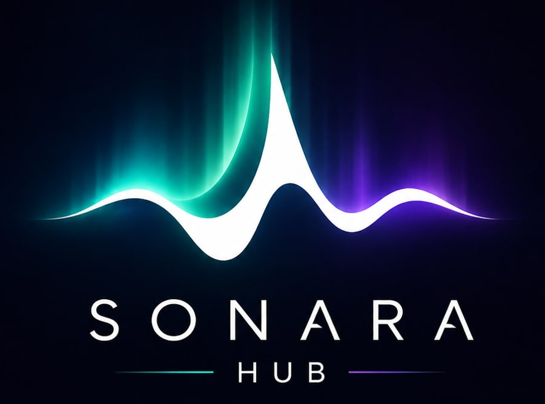
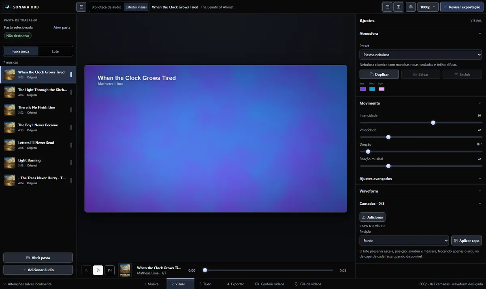
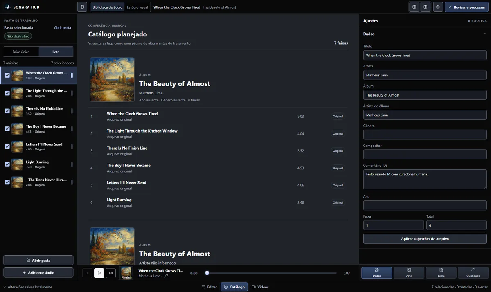
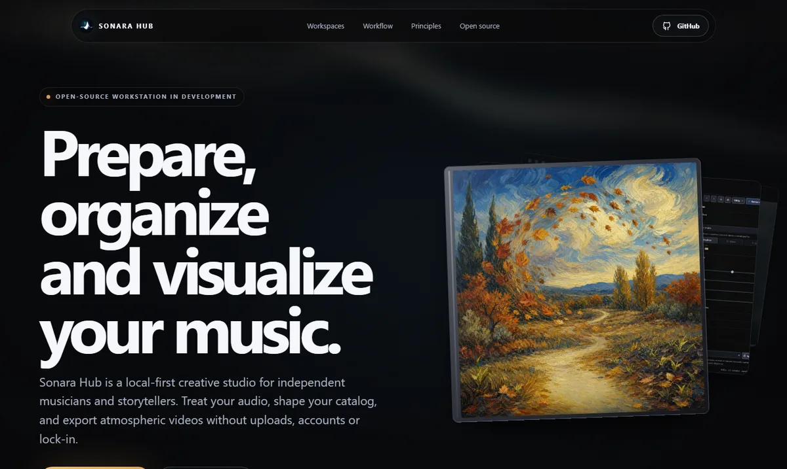

<p align="center">
  
</p>

<p align="center">
  <em>Estúdio local para transformar seus álbuns em vídeos ambientes prontos para publicar.</em>
</p>

---

Sonara Hub é um estúdio criativo que roda **na sua máquina** e une, num fluxo só,
duas etapas que normalmente ficam espalhadas por várias ferramentas:
**organizar o pacote de áudio** e **criar a presença visual** de cada faixa —
sem uploads, sem contas e sem depender da nuvem.

## O que você consegue fazer

- **Tratar e organizar o áudio** — abra uma pasta de músicas, revise tags
  ID3, capas e letras, analise loudness e pico verdadeiro e gere cópias MP3
  tratadas sem alterar os arquivos originais.
- **Transformar faixas em vídeo** — escolha uma cena animada, ajuste cores e
  reação à música, adicione camadas de mídia, waveform e texto. A mesma engine
  alimenta a prévia e a exportação, então o resultado final fica fiel ao editor.
- **Capas em série** — a partir de uma arte base, gere uma série visual para
  o álbum (I, II, III… ou textos), conferindo todas as capas lado a lado.
- **Publicar com facilidade** — revise a grade de vídeos e exporte em 720p,
  1080p, 2K ou 4K, com um sidecar `.youtube.json` opcional para apoiar a
  publicação.

## Veja em ação

### Estúdio visual



Cada faixa vira um vídeo com movimento suave: escolha a cena, ajuste cores,
camadas, waveform e texto — tudo com prévia ao vivo.

### Catálogo do álbum



Veja o álbum como uma página antes de exportar: capa, lista de faixas, tags e a
série de capas geradas.

## Cenas visuais

Um catálogo curado para funcionar como fundo de tela para música, todas com
cores, intensidade e reação ao áudio ajustáveis:

- **Atmosferas** — fluxo líquido, nuvens com foco solar, aurora e aura vetorial.
- **Shaders** — plasma e vórtice, efeitos WebGL reativos à música.
- **Composições** — vinil reativo com a capa do álbum e tela escura para áudio.
- **Cenas leves** — formas lúdicas, mesh colorido e faixas de piano.

## Como funciona

1. Abra uma pasta de músicas (ou adicione faixas avulsas).
2. Revise metadados, arte, letra e análise técnica na **Biblioteca de áudio**.
3. Gere as cópias tratadas e confira a página de catálogo.
4. No **Estúdio visual**, aplique cenas, capas, camadas, texto e waveform.
5. Exporte os vídeos na resolução desejada.

## O site do projeto



Há um site de apresentação com a proposta e telas do estúdio:
**[mafhper.github.io/sonara_hub](https://mafhper.github.io/sonara_hub/)**.

## Como rodar

> O Sonara Hub será distribuído como **instalador desktop** em breve. Por
> enquanto, ele roda a partir do código-fonte, seguindo os passos abaixo.

### 1. Pré-requisitos

- **Node.js 22 ou superior** (já inclui o `npm`) — baixe em
  [nodejs.org](https://nodejs.org/). Confira a instalação com `node -v`.
- **Git** para clonar o repositório — [git-scm.com](https://git-scm.com/).

### 2. Baixar o projeto

Clone o repositório e entre na pasta:

```bash
git clone https://github.com/mafhper/sonara_hub.git
cd sonara_hub
```

> Alternativa sem Git: baixe o ZIP em **Code → Download ZIP** na página do
> repositório e extraia.

### 3. Instalar os pacotes

```bash
npm ci
```

Isso instala todas as dependências exatamente como travadas no
`package-lock.json`. A instalação também baixa o **FFmpeg** (via
`ffmpeg-static`) e o navegador usado na exportação de vídeo — por isso pode
levar alguns minutos na primeira vez. (Se preferir uma instalação mais
tolerante a atualizações, use `npm install`.)

### 4. Rodar o aplicativo

```bash
npm run dev
```

Esse comando sobe os dois processos do app de uma vez:

- a **interface** (cliente) em `http://127.0.0.1:5173`;
- o **servidor local** (API de áudio, capas e exportação) em
  `http://127.0.0.1:4175`.

Abra **`http://127.0.0.1:5173`** no navegador e use o Sonara Hub. Para encerrar,
pressione `Ctrl+C` no terminal.

### 5. Gerar o build de produção (opcional)

Para compilar a interface otimizada (gerada em `dist/`):

```bash
npm run build
```

O `build` também roda a verificação de tipos (`type-check`). Para servir apenas
o servidor local (sem o modo de desenvolvimento da interface), use
`npm start`.

### Site de apresentação

O repositório inclui um site de apresentação separado, na pasta `site/`:

```bash
npm run site:dev    # desenvolvimento
npm run site:build  # build estático em site/dist
```

## Para desenvolvedores

Arquitetura, validação e contribuição estão documentadas em
[docs/development.md](docs/development.md).
